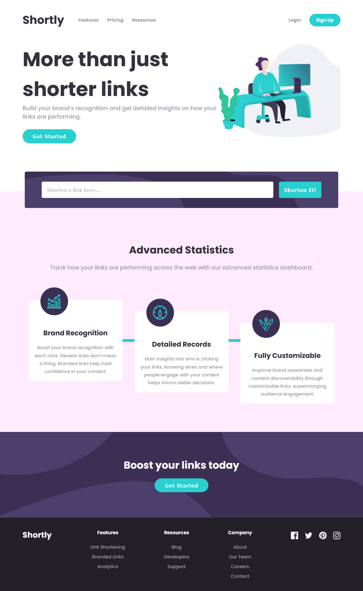

# Frontend Mentor - Shortly URL shortening API Challenge solution

This is a solution to the [Shortly URL shortening API Challenge challenge on Frontend Mentor](https://www.frontendmentor.io/challenges/url-shortening-api-landing-page-2ce3ob-G). Frontend Mentor challenges help you improve your coding skills by building realistic projects.

## Table of contents

- [Overview](#overview)
  - [The challenge](#the-challenge)
  - [Screenshot](#screenshot)
  - [Links](#links)
- [My process](#my-process)
  - [Built with](#built-with)
  - [What I learned](#what-i-learned)
  - [Continued development](#continued-development)
  - [Useful resources](#useful-resources)
- [Author](#author)

## Overview

### The challenge

Users should be able to:

- View the optimal layout for the site depending on their device's screen size
- Shorten any valid URL
- See a list of their shortened links, even after refreshing the browser
- Copy the shortened link to their clipboard in a single click
- Receive an error message when the `form` is submitted if:
  - The `input` field is empty

### Screenshot

### Links

- Solution URL: [https://github.com/jeansy42/url-shortening-api-master](https://github.com/jeansy42/url-shortening-api-master)
- Live Site URL: [https://jeansy42.github.io/url-shortening-api-master/](https://jeansy42.github.io/url-shortening-api-master/)

## My process

### Built with

- Semantic HTML5 markup
- CSS custom properties
- Flexbox
- CSS Grid
- Mobile-first workflow
- [React](https://reactjs.org/) - JS library
- [Sass](https://sass-lang.com/) - CSS preprocessor

### What I learned

The development of this project was very important, with each new challenge, you always learn something new. I put TypeScript into practice for the first time, and I perceived its organizational and intuitive power. I also learned about another JavaScript resource, such as the clipboard, and applied its utility.

### Continued development

I intend to keep studying, strengthen my programming foundations even more, and achieve the highest possible versatility. I will continue to deepen my knowledge of JavaScript, TypeScript, and the React ecosystem.

### Useful resources

- [ChatGPT](https://chat.openai.com/) - My right hand, always clarifying doubts and making development more viable.

## Author

- Frontend Mentor - [@jeansy42](https://www.frontendmentor.io/profile/jeansy42)
- Twitter - [@jeansy42](https://www.twitter.com/jeansy42)
